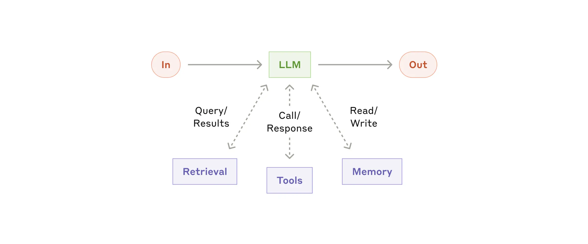

# Building AI Agents with LittleHorse

This directory contains practical examples of how to build AI-powered applications using LittleHorse. LittleHorse is a workflow engine that helps you coordinate different AI tasks, handle errors, and manage complex processes. Think of it like a conductor for your AI orchestra - it helps different AI components work together smoothly.

## Building Blocks: The Augmented LLM

When we talk about an "augmented LLM" (Large Language Model), we mean an AI system that can do more than just chat. It's like giving your AI assistant superpowers:

1. **Retrieval**: Instead of just relying on what it knows, it can look up information from databases, documents, or the internet when needed. For example, if you ask about current events, it can fetch the latest news.

2. **Tools**: It can use other software tools and services. Imagine your AI assistant being able to check your calendar, send emails, or update a database - all through simple conversation.

3. **Memory**: It can remember previous conversations and use that context to give better responses. If you're discussing a project, it remembers what you talked about earlier in the conversation.

## AI Workflow Patterns

### Prompt Chaining

Prompt chaining decomposes a task into a sequence of steps, where each LLM call processes the output of the previous one. You can add programmatic checks (see "gate” in the diagram below) on any intermediate steps to ensure that the process is still on track.

**When to use this workflow:** This workflow is ideal for situations where the task can be easily and cleanly decomposed into fixed subtasks. The main goal is to trade off latency for higher accuracy, by making each LLM call an easier task.

**Examples where prompt chaining is useful:**

- Generating Marketing copy, then translating it into a different language.
- Writing an outline of a document, checking that the outline meets certain criteria, then writing the document based on the outline.

### Routing

Routing classifies an input and directs it to a specialized followup task. This workflow allows for separation of concerns, and building more specialized prompts. Without this workflow, optimizing for one kind of input can hurt performance on other inputs.

**When to use this workflow:** Routing works well for complex tasks where there are distinct categories that are better handled separately, and where classification can be handled accurately, either by an LLM or a more traditional classification model/algorithm.

**Examples where routing is useful:**

- Directing different types of customer service queries (general questions, refund requests, technical support) into different downstream processes, prompts, and tools.
- Routing easy/common questions to smaller models like Claude 3.5 Haiku and hard/unusual questions to more capable models like Claude 3.7 Sonnet to optimize cost and speed.

### Parallelization

LLMs can sometimes work simultaneously on a task and have their outputs aggregated programmatically. This workflow, parallelization, manifests in two key variations:

- **Sectioning:** Breaking a task into independent subtasks run in parallel.
- **Voting:** Running the same task multiple times to get diverse outputs.

**When to use this workflow:** Parallelization is effective when the divided subtasks can be parallelized for speed, or when multiple perspectives or attempts are needed for higher confidence results. For complex tasks with multiple considerations, LLMs generally perform better when each consideration is handled by a separate LLM call, allowing focused attention on each specific aspect.

**Examples where parallelization is useful:**

- **Sectioning:**
  - Implementing guardrails where one model instance processes user queries while another screens them for inappropriate content or requests. This tends to perform better than having the same LLM call handle both guardrails and the core response.
  - Automating evals for evaluating LLM performance, where each LLM call evaluates a different aspect of the model’s performance on a given prompt.
- **Voting:**
  - Reviewing a piece of code for vulnerabilities, where several different prompts review and flag the code if they find a problem.
  - Evaluating whether a given piece of content is inappropriate, with multiple prompts evaluating different aspects or requiring different vote thresholds to balance false positives and negatives.

### Orchestrator-Workers

In the orchestrator-workers workflow, a central LLM dynamically breaks down tasks, delegates them to worker LLMs, and synthesizes their results.

**When to use this workflow:** This workflow is well-suited for complex tasks where you can’t predict the subtasks needed (in coding, for example, the number of files that need to be changed and the nature of the change in each file likely depend on the task). Whereas it’s topographically similar, the key difference from parallelization is its flexibility—subtasks aren't pre-defined, but determined by the orchestrator based on the specific input.

**Examples where orchestrator-workers is useful:**

- Coding products that make complex changes to multiple files each time
- Search tasks that involve gathering and analyzing information from multiple sources
- Complex data processing pipelines where the steps needed depend on the input data

### Evaluator-Optimizer

In the evaluator-optimizer workflow, one LLM call generates a response while another provides evaluation and feedback in a loop.

**When to use this workflow:** This workflow is particularly effective when we have clear evaluation criteria, and when iterative refinement provides measurable value. The two signs of good fit are, first, that LLM responses can be demonstrably improved when a human articulates their feedback; and second, that the LLM can provide such feedback.

**Examples where evaluator-optimizer is useful:**

- Literary translation where there are nuances that the translator LLM might not capture initially
- Complex search tasks that require multiple rounds of searching and analysis
- Code generation where the initial solution needs refinement based on test results and style guidelines
