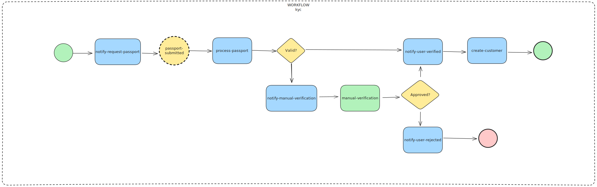
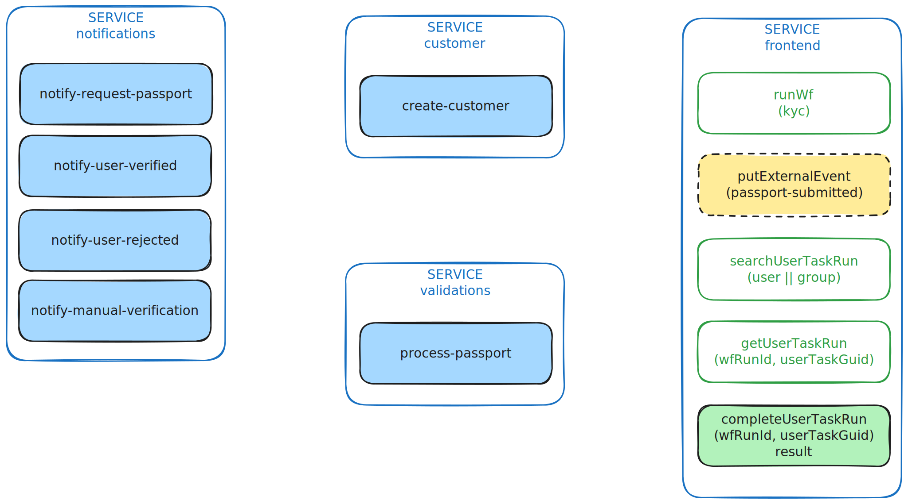

# KYC Workflow

## How to use

First run

```bash
docker compose up -d
```
It'll take a while building the docker images and a few seconds to fully deploy all the microservices:

- lh-standalone (littlehorse)
- notifications (java)
- verifications (java)
- customer (java)
- customers-db (postgresql)
- workflow (go)
- frontend (typescript)

Then access [http://localhost:3000](http://localhost:3000)

If you want to view the VoidMailer outputs you can run:

```bash
docker compose logs notifications -f
```

## Workflow



## Services


