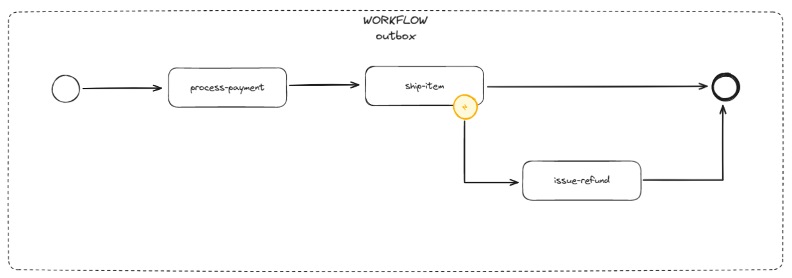
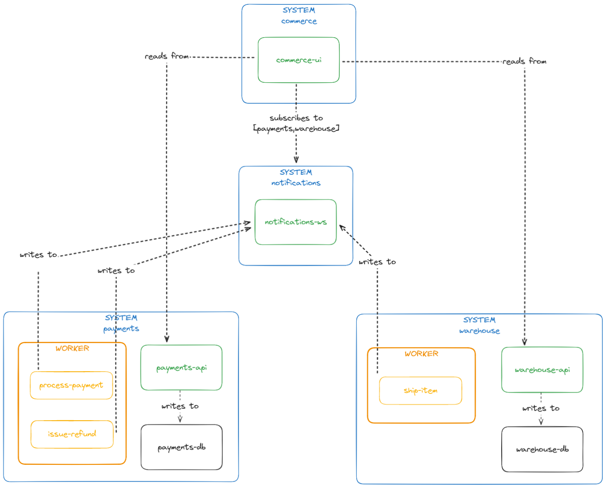

# Transactional Outbox


## How to use

First run

```bash
docker-compose up -d
```
It'll take a while building the docker images and a few seconds to fully deploy all the microservices:

- lh-standalone
- warehouse
- warehouse-db
- payments
- payments-db
- commerce
- notifications

Then use `setup.http` with either intelliJ or vscode or run this

```bash
# Payments service running on port 8081
curl --request POST \
  --url http://localhost:8081/transaction/credit \
  --header 'content-type: application/json' \
  --data "{\"account\": \"GIFT130\",\"amount\": 130.00,\"idempotencyKey\": \"$(uuidgen)\"}"
```


```bash
# Warehouse service running on port 8082
curl --request POST \
  --url http://localhost:8082/transaction/credit \
  --header 'content-type: application/json' \
  --data "{\"account\": \"cookies\",\"amount\": 20.00,\"idempotencyKey\": \"$(uuidgen)\"}"
```

    Please note that even though both request share the same signature, they are isolated services.

Then you can navigate to http://localhost:3000 and use `GIT130` as your Giftcard code.


## Workflow



## Architecture


