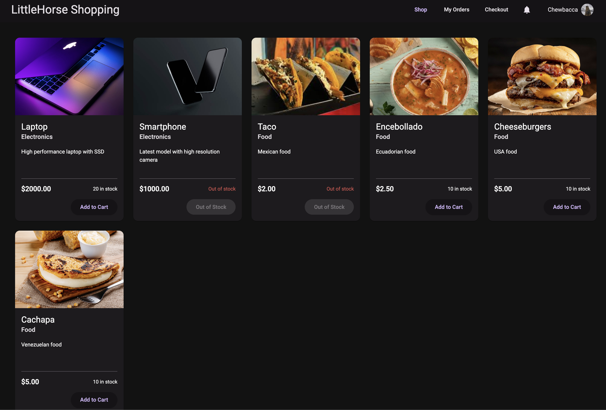
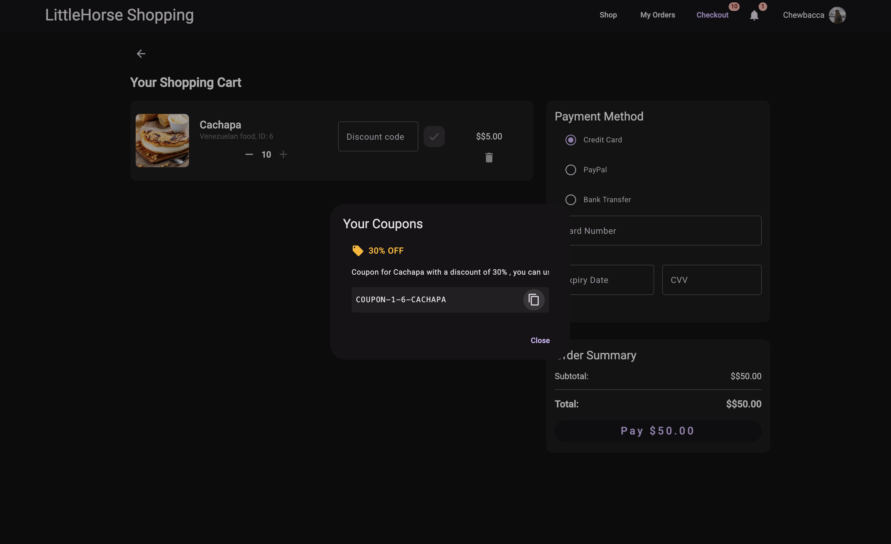

# Order Resilience Demo

This demo showcases a microservices-based e-commerce application with resilience patterns implemented to handle various failure scenarios.

## System Architecture

The application consists of the following components:

- **Order Service** (Port 8080): Handles order processing and coordinates with other services
- **Customer Service** (Port 8081): Manages customer data and accounts
- **Product Service** (Port 8082): Manages product catalog and inventory
- **Promo Service** (Port 8083): Handles promotional offers and coupon codes
- **Frontend** (Port 4200): Angular-based user interface
- **Database** (Port 5433): YugabyteDB (PostgreSQL-compatible distributed database)

## Prerequisites

- Java 17 or higher
- Docker and Docker Compose
- Node.js (v14+) and npm
- Angular CLI (`npm install -g @angular/cli`)

## LittleHorse Dependency

This demo depends on the [LittleHorse repository](https://github.com/littlehorse-enterprises/littlehorse) using the `input-variables-and-output-topic` branch. Before running the demo, you need to:

1. Clone and checkout the required branch:
   ```bash
   git clone https://github.com/littlehorse-enterprises/littlehorse
   cd littlehorse
   git checkout input-variables-and-output-topic
   ```

2. Start the Kafka cluster:
   ```bash
   # Start the Kafka cluster using compose
   ./local-dev/setup.sh
   ```

3. Start the LittleHorse server with the required fixes in the branch:
   ```bash
   ./local-dev/do-server.sh
   ```

## Running the Demo

Use the provided script to build and start all services:

```bash
# In a new terminal, start all services (database, microservices, and frontend)
./start_demo.sh
```

After starting the services, you can access the frontend at: http://localhost:4200

Once you're done with the demo, you can shut down all services with:

```bash
# Stop all services
./kill_services.sh
```

## API Usage Examples

### Increasing Product Stock

To increase the stock for a specific product, use the following curl command:

```bash
curl --location 'localhost:8082/api/products/stock' \
--header 'Content-Type: application/json' \
--data '{
   "productId": 3,
   "quantity": 11
}'
```

This will add 11 units to the stock of the product with ID 3.

## User Flow

### User Selection

When you first access the frontend at http://localhost:4200, you'll be presented with a user selection screen where you can choose an account to start shopping:


The demo comes pre-configured with three fictional user accounts:
- **Chewbacca** (chewie@rebellion.org)
- **Darth Vader** (vader@empire.gov)
- **R2D2** (r2d2@rebellion.org) this user can not place orders

Select any user to begin the shopping experience. Each user has their own shopping cart and order history.

### Product Selection

After selecting a user, you'll be taken to the main shopping page where you can browse available products:



The store offers various products across different categories:

**Electronics:**
- Laptop ($2000.00) - High performance laptop with SSD
- Smartphone ($1000.00) - Latest model with high resolution camera

**Food:**
- Taco ($2.00) - Mexican food
- Encebollado ($2.50) - Ecuadorian food
- Cheeseburgers ($5.00) - USA food
- Cachapa ($5.00) - Venezuelan food

Each product displays its current stock status. You can add available items to your cart by clicking the "Add to Cart" button. Items that are out of stock will display "Out of Stock" and cannot be added to the cart.

The navigation bar at the top allows you to access:
- Shop (current page)
- My Orders (to view order history)
- Checkout (to complete your purchase)

### Checkout Process

After adding items to your cart, you can proceed to checkout by clicking the "Checkout" button in the navigation bar:


The checkout page shows:

1. **Your Shopping Cart**
   - Details of each item (image, name, description, quantity)
   - Option to adjust quantities with "+" and "-" buttons
   - Discount code field for each item
   - Option to remove items from cart (trash icon)
   - Individual item price

2. **Payment Method** (Demonstration Only)
   - Credit Card (default)
   - PayPal
   - Bank Transfer
   - Card details input fields (Card Number, Expiry Date, CVV)
   
   > Note: The payment method section is purely for demonstration purposes and doesn't actually process any payments. You can enter any values in the fields to proceed with the demo.

3. **Order Summary**
   - Subtotal of all items
   - Total amount to be paid
   - "Pay" button with the final amount

Once you've entered the payment details, click the "Pay" button to place your order. The system will process the order using the resilient microservices architecture.

### Order History

After successfully placing an order, you'll see a confirmation message and can view your order history by clicking on "My Orders" in the navigation bar:


The Order History page shows:

1. **Order List**
   - Order ID
   - Status (COMPLETED)
   - Total amount
   - Date and time of purchase
   - Number of items

2. **Order Details**
   When you expand an order (by clicking on it), you'll see detailed information:
   - Product image
   - Product name
   - Quantity
   - Unit price
   - Discount (if applicable)
   - Total for each item

Each successful order is processed through the microservices architecture, demonstrating the resilience patterns implemented in the system. The green "COMPLETED" status indicates that all services involved in processing the order completed their tasks successfully.

You can continue shopping by clicking the "Continue Shopping" button at the top right of the page.

## Error Handling and Resilience Features

### Error Notifications

The application implements various resilience patterns to handle failure scenarios. When an order cannot be processed immediately due to issues like insufficient stock or missing ingredients, an error notification appears:


As shown above, the system will display a notification explaining the issue (e.g., "Sorry, no ingredients for preparing Cachapa") but allows users to place the order for later processing ("but you can order it later").

### Automatic Coupon Generation

One of the key resilience features is the automatic coupon generation system:

- If an order for the same item fails 3 times due to stock issues or missing ingredients, the system will automatically generate a coupon for that specific item
- The user will receive a notification about the coupon
- This coupon can be applied during checkout in the discount code field for the affected item
- This compensates users for the inconvenience while allowing the system time to recover

This pattern demonstrates how the system can maintain a positive user experience even during service disruptions, implementing the Circuit Breaker and Compensating Transaction patterns.

### Coupon Notification and Usage

When a coupon is generated after multiple failed order attempts, a notification appears with coupon details:



The notification shows:
1. **Your Coupons** - Header showing available coupons
2. **Discount Information** - Details of the discount (e.g., "30% OFF")
3. **Coupon Description** - Text explaining the coupon and its discount percentage
4. **Coupon Code** - The actual code (e.g., "COUPON-1-6-CACHAPA") that can be copied to clipboard
5. **Copy Button** - Allows easy copying of the coupon code

To use a coupon:
1. Enter the coupon code in the "Discount code" field next to the specific item during checkout
2. Click the check mark button to apply the discount
3. The discount will be reflected in the order summary totals

This coupon system demonstrates the application's ability to recover from failures gracefully while maintaining a positive user experience.

### Applied Coupon View

When a coupon is successfully applied to an item, the discount is clearly displayed in the checkout process:


The system shows:
1. A confirmation tag with the applied discount percentage and coupon code
2. The discount amount is displayed in red in the Order Summary section
3. The final total is recalculated to reflect the discount

## Complete System Flow Summary

The Order Resilience Demo showcases a comprehensive e-commerce system with robust resilience patterns:

1. **Initial Setup Flow**
   - LittleHorse server is started with the required branch
   - Microservices (Order, Customer, Product, Promo) are launched
   - Frontend application becomes available

2. **User Interaction Flow**
   - User selects an account (Chewbacca, Darth Vader, or R2D2)
   - User browses products and adds items to cart
   - User proceeds to checkout and enters payment information
   - User submits the order

3. **Order Processing Flow**
   - Order service coordinates with other microservices
   - Customer validation is performed
   - Product inventory is checked and updated
   - Promotional codes are validated if applied
   - Order status is tracked throughout the process

4. **Resilience Pattern Demonstration**
   - **Service Failure Handling**: If a service is unavailable, appropriate error messages are displayed
   - **Retry Mechanism**: System attempts to process orders multiple times
   - **Circuit Breaker**: After multiple failures, the system stops attempting the same operation
   - **Compensating Transactions**: Coupons are generated to compensate for service failures

5. **Coupon Lifecycle**
   - Coupon is automatically generated after 3 failed attempts for the same item
   - User is notified of the available coupon
   - User can apply the coupon during checkout for a discount
   - Once an order with a coupon is successfully processed, the coupon is invalidated and cannot be used again
   - This one-time use policy ensures proper compensation while preventing abuse

6. **Order Completion**
   - Successful orders are recorded in the order history
   - All transactions are stored in the database
   - User can view detailed information about past orders

This comprehensive flow demonstrates how a well-designed microservices architecture can handle failures gracefully, maintain data consistency, and provide a seamless user experience even when individual components experience issues.