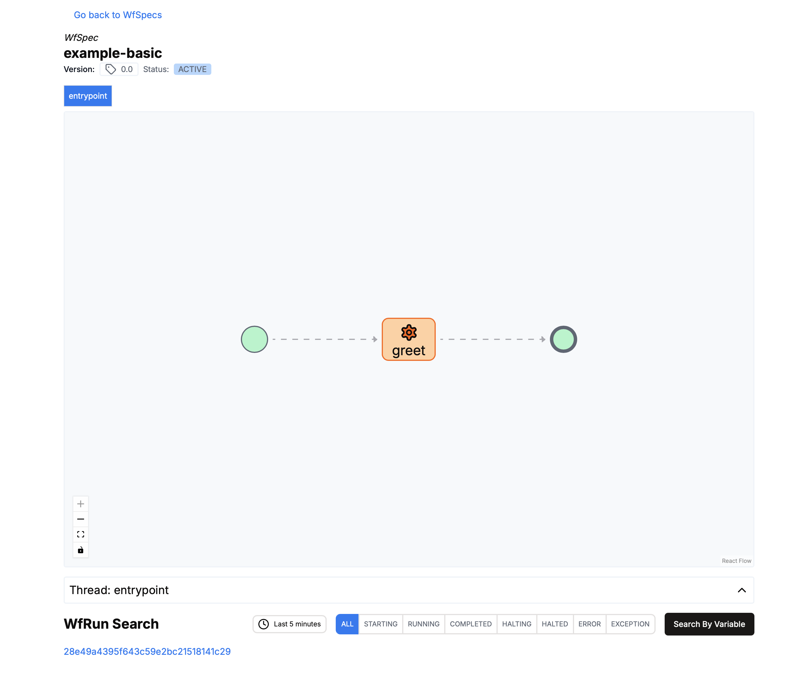

# Scala LH Example

## Requirements

- lhctl `brew install lhctl`
- sbt `brew install sbt`
- scala 3
- docker

## Config

Add your littlehorse configuration ~/.config/littlehorse.config

```conf
LHC_API_PORT=2023
LHC_API_HOST=localhost
```

## Run

```sh
docker run --pull always --name lh-standalone --rm -d -p 2023:2023 -p 8080:8080 \
  ghcr.io/littlehorse-enterprises/littlehorse/lh-standalone:latest
sbt run
```

### Running the workflow

```sh
lhctl run example-basic input-name Obi-Wan
```

Then you should ge able to inspect the workflow run in the dashboard: [http://localhost:8080/wfSpec/example-basic](http://localhost:8080/wfSpec/example-basic)


